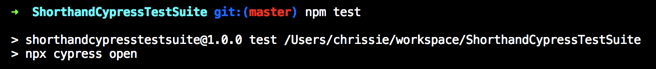
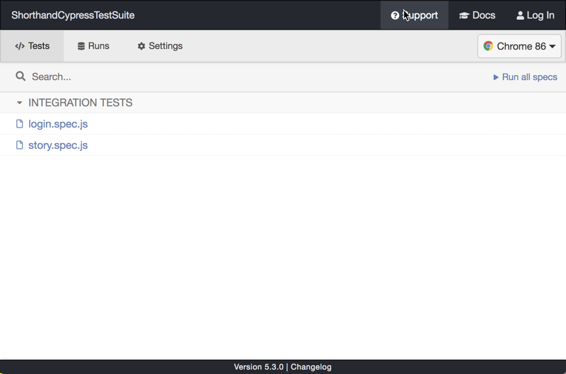
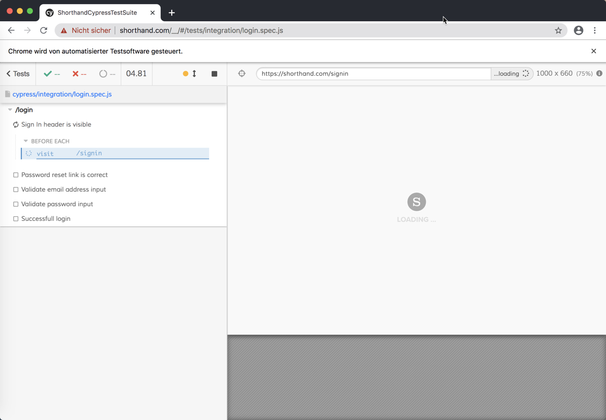
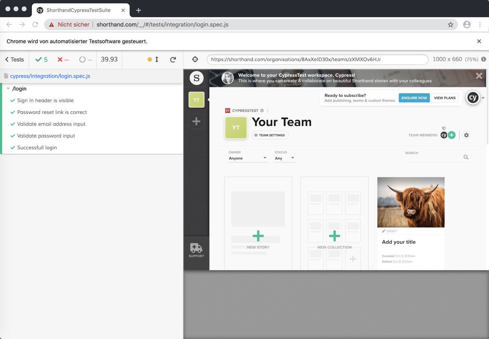

# Shorthand Cypress TestSuite
This is my first test suite with Cypress.io. It's a simple test setup to try out Cypress.io.
This test suite checks the login and creation of a blank story in the Shorthand editor (https://shorthand.com/).

# Testsuite
The following are the performed tests:
- Login
  - Check Sign In header is visible
  - Password reset link is correct
  - Validate email address input
  - Validate password input
  - Successful login with a registered user
  
 - Story
    - Check if the "create a new story" button is visible
    - Create a new blank story
    - Create a new "text over media" section in a new blank story

Open test cases:
- Login
  - Test error messages (e.g. empty password field) in the Sign In form
  - Adapt assertions for multi-language use

- Story
  - Implement a "Dynamic User" strategy
    - Database setup or reset after each test to ensure a clean test state
  - Add more tests for the creation of all types of sections
  - Implement image upload
  
# How to start the test

1. Clone this repository 
2. Execute 'npm install' in your local folder to install all dependencies (including cypress.io)
3. Change the user credentials in cypress.json or add cypress.env.json file (provided by me)
3. Execute 'npm test' to start the cypress test runner

4. Cypress is opening  

5. Select one of the tests and double-click on it
6. The test will automatically start and execute the defined assertions and steps

7. At the end you can see the results of the executed tests

