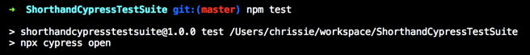
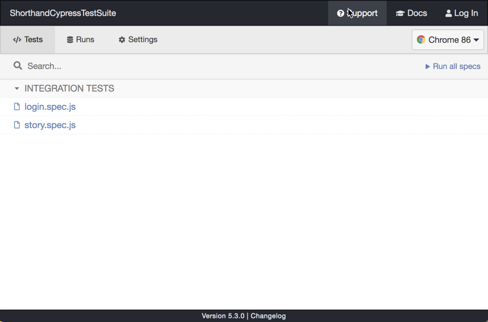
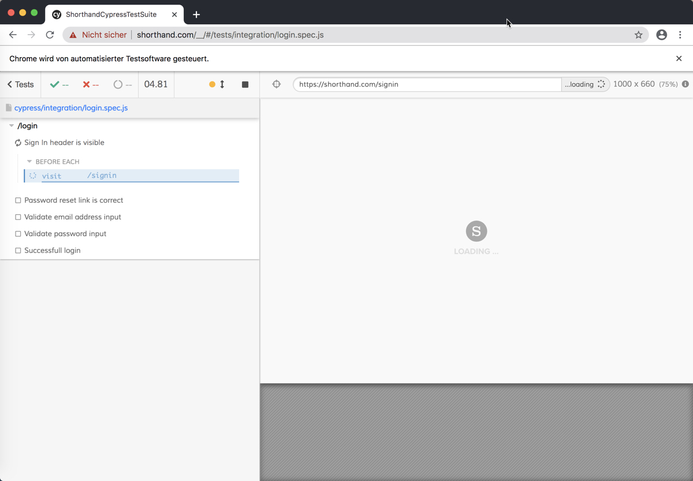
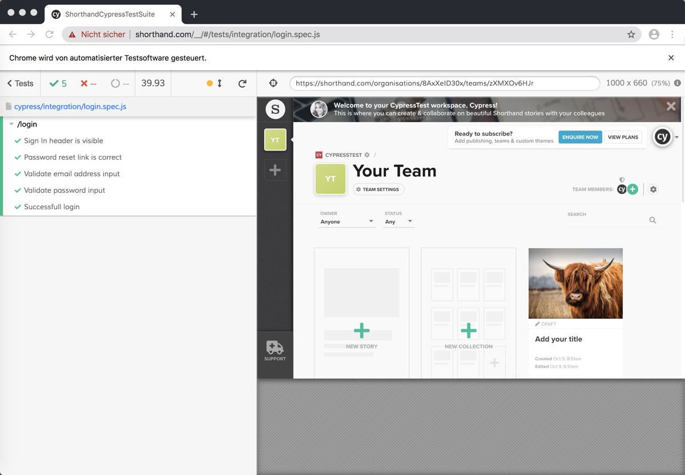

# ShorthandCypressTestSuite
This is a Cypress test suite to test the login and creation of a blank story in the Shorthand editor

# How to start the test

1. Clone this repository 
2. Execute 'npm install' in your local folder to install all dependencies (including cypress.io)
3. Execute 'npm test' to start the cypress test runner

4. Cypress is opening  

5. Select one of the tests and double-click on it
6. The test will automatically start and execute the defined assertions and steps

7. At the end you can see the results of the executed tests

